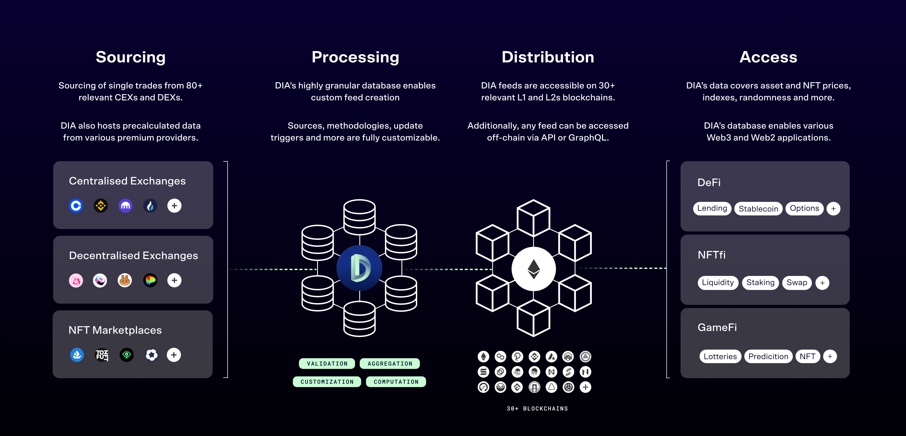

# DIA Cardano Oracle



Implementation repository for the DIA oracle integration on Cardano.

This repository is part of the Project Catalyst initiative **Integration of DIA Price Oracles on Cardano** and contains the work required to deliver the Cardano-specific oracle contracts, supporting off-chain components, deployment tooling, validation flows, and project documentation.

The current implementation direction preserves Cardano wallets as configuration and submission authorities, while oracle price validity is derived from official DIA `OracleIntent` payloads and their `EIP-712` secp256k1 signatures.

## Status

This repository is under active development.

## Project Context

The objective of this project is to deliver a Cardano-native integration for DIA price oracles, including:

- on-chain oracle contracts
- off-chain update submission components
- operational and deployment tooling
- monitoring and validation artifacts
- developer documentation

Project references:

- Catalyst proposal: <https://projectcatalyst.io/funds/14/cardano-use-cases-concepts/integration-of-dia-price-oracles-on-cardano>
- Catalyst milestone page: <https://milestones.projectcatalyst.io/projects/1400073>

## Repository Scope

The repository is organized around the main project areas:

- [`contracts/`](contracts): on-chain implementation artifacts
- [`offchain/`](offchain): off-chain implementation artifacts
- [`e2e/`](e2e): end-to-end validation artifacts
- [`specs/`](specs): milestone, requirement, design, and reference documents
- [`docs/`](docs): technical and operational documentation
- [`scripts/`](scripts): automation artifacts
- [`infra/`](infra): infrastructure-related artifacts

## Primary Documents

- [Milestone Mapping](specs/milestone-mapping.md)
- [Architecture Overview](docs/architecture/overview.md)
- [Final Cardano Milestones](specs/milestones/final-cardano-milestones.md)
- [Cardano Integration Requirement [PF]](specs/requirements/cardano-integration-requirement-pf.md)
- [Cardano Oracle Integration – Technical Specification](specs/design/cardano-oracle-integration-technical-specification.md)
- [Reference Links](specs/references/input-links.md)

## Preview Workflow

The current implementation flow starts on the Cardano `Preview` network before any mainnet milestone run.

The current operator sequence is:

1. Inspect the generated contract blueprint:

```sh
cd offchain/cli
npm install
npm run cli -- blueprint:list
```

2. Verify protocol access through the configured Preview provider:

```sh
npm run cli -- preview:protocol
```

3. Create a Preview wallet with the off-chain CLI:

```sh
npm run cli -- preview:wallet:create
```

4. Fund the generated address through the official Cardano faucet:

- Faucet guide: <https://docs.cardano.org/cardano-testnets/tools/faucet>
- Environment: `Preview Testnet`

5. Configure the generated wallet and Preview provider in `offchain/cli/.env`.

6. Verify wallet and provider access:

```sh
npm run cli -- preview:wallet
npm run cli -- preview:wallet:defaults
```

7. Bootstrap the Config state and persist the result under `offchain/cli/state/preview/`.
   The Config state stores the Cardano config signers, the authorized DIA oracle public keys, and the `EIP-712` domain parameters required for intent verification.

8. Bootstrap each pair from that persisted config state and store pair-specific outputs under `offchain/cli/state/preview/pairs/`.
   Pair bootstrap consumes an official DIA `OracleIntent` fixture and creates the initial oracle state on Cardano.

9. Submit oracle updates from the persisted pair state files and overwrite them with the latest confirmed on-chain state.
   Oracle updates consume newer DIA `OracleIntent` payloads for the same symbol and verify the recovered signer against the authorized DIA key set stored in Config.

The CLI model is non-interactive:

- `.env` for secrets and provider configuration
- JSON input files for repeatable execution commands
- persisted deployment state under `offchain/cli/state/preview/`
- explicit commands for config bootstrap, config update, pair bootstrap, and oracle update flows

## Reference Implementations

The current document set references DIA interoperability contracts and related materials, including:

- <https://github.com/diadata-org/Spectra-interoperability>
- <https://github.com/diadata-org/diadata>
