# Cardano Oracle Architecture

This document is the single architecture reference for the Cardano port of DIA's push-oracle contracts. It defines the contract set, UTxO model, datums, transaction shapes, deployment sequence, and open items pending DIA confirmation.

Reference inputs to this document:

- [Cardano Integration Requirement [PF]](../requirements/cardano-integration-requirement-pf.md)
- [Final Cardano Milestones](../milestones/final-cardano-milestones.md)

---

## 1. Contracts (scripts)

### 1.1 Scripts and compile-time parameters

| # | Script | Kind | Instances | Compile-time parameters |
|---|---|---|---|---|
| 1 | `config_state` | multivalidator (mint + spend) | 1 global | `bootstrap_ref_config: OutputReference`, `config_asset_name: AssetName` |
| 2 | `update_coordinator` | stake withdraw | 1 global | `config_policy_id: PolicyId`, `config_asset_name: AssetName` |
| 3 | `payment_hook` | multivalidator (mint + spend) | 1 global | `bootstrap_ref_hook: OutputReference`, `hook_asset_name: AssetName`, `config_policy_id`, `config_asset_name`, `coordinator_credential: Credential` |
| 4 | `receiver` | multivalidator (mint + spend) | 1 per client | `receiver_ref: OutputReference`, `receiver_asset_name: AssetName`, `config_policy_id`, `config_asset_name` |
| 5 | `pair_state` | multivalidator (mint + spend) | 1 per client | `config_policy_id`, `config_asset_name`, `receiver_hash: ScriptHash` |
| 6 | `reference_holder` | spend validator | 1 global | none |

Notes:

- The reusable global validators (`config_state` spend, `update_coordinator` withdraw, `payment_hook` spend) are published as reference scripts. One-shot minting policies are used only by their bootstrap transactions.
- `receiver` is recompiled every time DIA onboards a new client. A fresh `receiver_ref` per client yields a different script hash and therefore a different address. The client is not an admin of their Receiver: they only prepay ADA and consume prices off-chain, matching the EVM behaviour. Every privileged action on the Receiver is signed by DIA admin (the `config_admins`).
- `pair_state` is recompiled per client too, parametrized by that client's `receiver_hash`, so every client's pairs live in their own address, isolated from other clients' pairs.
- `update_coordinator` runs once per update transaction using the `withdraw 0` trigger. It centralizes the shared logic (DIA signature check, fee movement, continuity) so the per-UTxO validators do not duplicate those checks.
- `reference_holder` is used only as the address for reference-script UTxOs. It rejects spend attempts so these UTxOs are not spendable by the deploy wallet.

### 1.2 Compile-time dependency graph

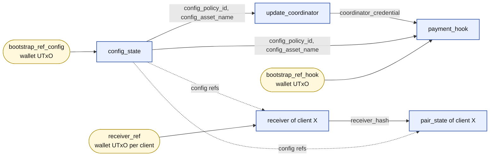

Solid arrows are compile-time inputs that change the script hash. Dashed arrows mark parameters that only pin the script to a given Config instance but follow directly from the global compilation.

### 1.3 Setup sequence

**Global setup, done once by DIA.**

1. Initialize the protocol artifact: record the deploy wallet, the `reference_holder` address, and empty protocol deployment slots.
2. Parameterize Config scripts: select an existing wallet UTxO as `bootstrap_ref_config`, compile `config_state`, compile `update_coordinator`, and record `config_policy_id` plus `coordinator_credential`.
3. Submit Config bootstrap: consume `bootstrap_ref_config`, mint the Config NFT, and create the Config UTxO with its initial datum.
4. Publish Config reference scripts: create ReferenceHolder UTxOs for `config_state` spend and `update_coordinator` withdraw.
5. Parameterize PaymentHook scripts: select an existing wallet UTxO as `bootstrap_ref_hook`, compile `payment_hook`, and record the Hook policy, validator hash, and address.
6. Submit PaymentHook bootstrap: consume `bootstrap_ref_hook`, mint the Hook NFT, update the Config datum to point at the Hook and the coordinator, and carry a stake-registration certificate for `coordinator_credential`.
7. Publish PaymentHook reference script: create the ReferenceHolder UTxO for `payment_hook` spend.

**Per-client onboarding, done once per client by DIA.**

1. Initialize the client artifact from the live protocol artifact.
2. Parameterize client Receiver scripts: select an existing wallet UTxO as `receiver_ref`, compile `receiver`, compile `pair_state`, and record the client's Receiver and Pair script metadata.
3. Submit Receiver bootstrap: consume `receiver_ref`, mint the Receiver NFT, and create the Receiver UTxO with `balance_lovelace = 0`.
4. Publish client reference scripts: create ReferenceHolder UTxOs for this client's `receiver` spend and `pair_state` spend scripts.
5. Top up the Receiver before live updates. The first update for each subscribed pair mints the Pair NFT and creates the Pair UTxO from the signed intent's real datum.

### 1.4 Reference-script deployment (global)

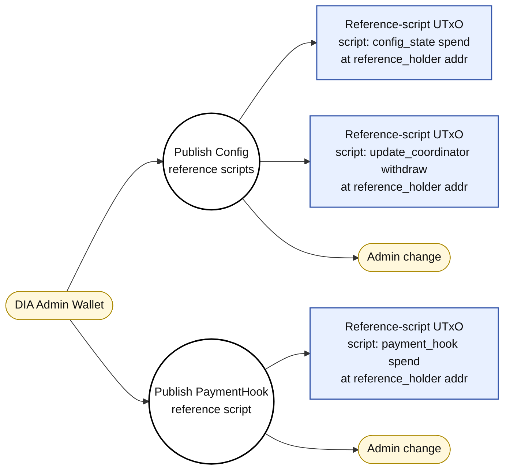

- **Frequency:** once per chain. Config and Coordinator reference scripts are published after Config bootstrap. PaymentHook reference script is published after PaymentHook bootstrap.
- **Inputs:** admin wallet UTxOs funding the min-UTxO of each reference-script output.
- **Outputs:** three reference-script UTxOs, each carrying the reusable compiled script binary in its `reference_script` field. No datum, no mint, no redeemer.
- **Address:** the `reference_holder` script address.
- **Minting policies:** Config and PaymentHook minting policies are one-shot bootstrap scripts and are not published as reference scripts.

### 1.5 Reference-script deployment (per client, per-client step 4 above)

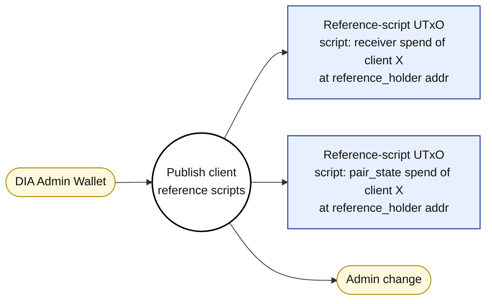

- **Frequency:** once per onboarded client, after Receiver bootstrap for that client.
- **Inputs:** admin wallet UTxOs.
- **Outputs:** two reference-script UTxOs carrying the client-specific `receiver` and `pair_state` binaries.
- **Isolation:** the binaries embed `receiver_ref` and `receiver_hash` respectively, so each client has its own pair of reference-script UTxOs with distinct hashes; they cannot be reused across clients.
- **Minting policies:** Receiver minting is one-shot/bootstrap. Pair minting is client-scoped and used by update transactions when a pair does not exist yet; the Pair spend validator is published as a reference script.

---

## 2. Identity tokens (state tokens)

All are NFTs (quantity 1, fixed asset name).

| Token | Minting policy | Minted on | Purpose |
|---|---|---|---|
| Config NFT | `config` | Config bootstrap | Marks the canonical Config UTxO |
| PaymentHook NFT | `payment_hook` | Hook bootstrap | Marks the canonical Hook UTxO |
| Receiver NFT | `receiver` | Receiver bootstrap (per client) | Marks the canonical Receiver UTxO for that client |
| Pair NFT | `pair_state` | First oracle update for that pair | Marks the canonical Pair UTxO for that client and pair |

Per DIA's request, these NFTs are not a "client identity" mechanism. They are state tokens required by the eUTxO model to identify the live UTxO of each state. Client identity remains the script hash of the client's Receiver (same principle as the EVM contract address being the client identifier).

---

## 3. UTxOs per script address

With `C` onboarded clients, client `i` subscribed to `N_i` pairs, the on-chain footprint is:

| Script address | State UTxOs at steady state | Reference-script UTxOs |
|---|---|---|
| `config_state` spend | 1 (Config UTxO) | 1 |
| `payment_hook` spend | 1 (PaymentHook UTxO) | 1 |
| `update_coordinator` | 0 (withdraw validator, no state UTxO) | 1 |
| `receiver` spend of client `i` | 1 (Receiver UTxO of client `i`) | 1 per client |
| `pair_state` spend of client `i` | `N_i` (one per subscribed pair) | 1 per client |

Totals:

- **ReferenceHolder UTxOs:** `3` global + `2` per client.
- **Global state UTxOs:** `1` Config + `1` Hook = `2`.
- **Per-client state UTxOs:** `1` Receiver + `N_i` Pairs for client `i`.
- **Total live state UTxOs on the chain:** `2 + sum_i (1 + N_i)`.
- **Reference-script UTxOs:** `3` global + `2` per client. These are one-off immutable UTxOs, not "live state"; they only exist so consumers can cite the script hash instead of embedding the binary in every tx.

Reference-script UTxOs are created at the `reference_holder` script address. The `reference_holder` validator rejects spend attempts, so these UTxOs are not spendable by the deploy wallet.

---

## 4. Datums

### 4.1 Config datum

```
{
  config_admins:              [PubKeyHash],          -- Cardano keys allowed to sign config changes and privileged Receiver actions
  authorized_dia_public_keys: [ByteArray(33)],       -- DIA secp256k1 compressed pubkeys that sign Intents
  domain: {
    name:               ByteArray,
    version:            ByteArray,
    source_chain_id:    Int,
    verifying_contract: ByteArray,
  },
  protocol_fee_lovelace: Int,                       -- fee moved Receiver -> Hook on each update
  payment_hook_ref:      ScriptHash,                -- active hook
  coordinator_cred:      Credential,                -- active update_coordinator stake credential
  min_utxo_lovelace:     Int,
}
```

Config does not carry a global pair allow-list.

### 4.2 PaymentHook datum

```
{
  withdraw_address:          Address,   -- payout target for withdrawals
  accrued_fees_lovelace:     Int,       -- current accumulated balance
  lifetime_collected_lovelace: Int,     -- historical collected
  lifetime_withdrawn_lovelace: Int,     -- historical withdrawn
  min_utxo_lovelace:         Int,
}
```

Invariant: `utxo.lovelace == min_utxo_lovelace + accrued_fees_lovelace`.

### 4.3 Receiver datum (per client)

```
{
  balance_lovelace:    Int,   -- prepaid pool
  min_utxo_lovelace:   Int,
}
```

Invariant: `utxo.lovelace == min_utxo_lovelace + balance_lovelace`.

Signers, fees and admins live in Config. The client has no on-chain representation inside the Receiver: their identity is the script address, derived from the bootstrap `OutputReference`. The `client -> address` mapping is kept off-chain.

### 4.4 Pair datum (per client, per pair)

```
{
  pair_id:            ByteArray,          -- e.g. "BTC/USD"
  price:              Int,
  timestamp:          Int,
  nonce:              Int,
  last_intent_hash:   ByteArray(32),      -- EIP-712 digest of the last applied Intent
  last_signer:        ByteArray(20),      -- Ethereum-style address from the last applied Intent
  min_utxo_lovelace:  Int,
}
```

Replay protection: `new.timestamp > old.timestamp && new.nonce > old.nonce`.

Binding to the client's Receiver is enforced by the `pair_state` script being parametrized by `receiver_hash`. `pair_id` is kept in the datum for cheap off-chain indexing, since the Pair NFT asset name is a one-way hash of `pair_id`.

---

## 5. Transactions

For each tx: inputs, reference inputs, mint, outputs, redeemers, required signers, what it validates.

**Diagram conventions.**

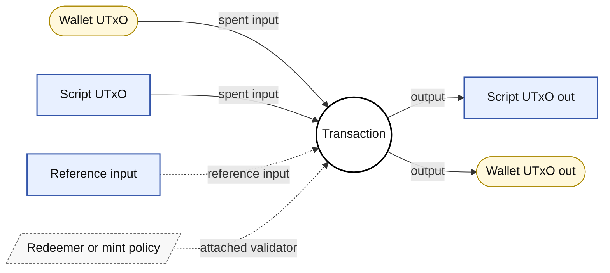

- Rounded nodes = wallet (PubKey) UTxOs.
- Sharp rectangles = script UTxOs (with datum).
- Parallelograms = redeemers / mint policies / withdraw scripts.
- Solid arrows = inputs being consumed or outputs being produced.
- Dashed arrows = reference inputs or attached validator / policy / withdrawal scripts.

### 5.1 Config bootstrap

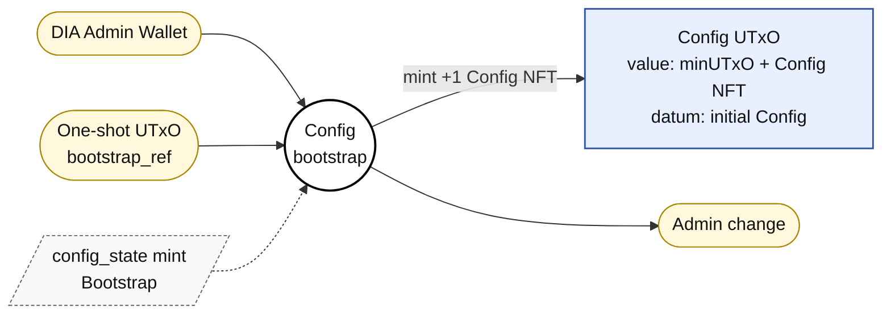

- **Frequency:** once per chain.
- **Inputs:**
  - DIA admin wallet (pays network fee + min UTxO).
  - The specific UTxO referenced by the policy's one-shot `OutputReference` parameter.
- **Reference inputs:** —
- **Mint:** `+1` Config NFT.
- **Outputs:** Config UTxO (address = `config` spend, value = `min_utxo_lovelace` + Config NFT, datum = initial Config datum).
- **Mint redeemer:** `Bootstrap`.
- **Signers:** at least one of the `config_admins` listed in the output datum.
- **Validates:**
  - The parametrized output reference is consumed (one-shot guarantee).
  - Exactly one Config NFT is minted with the expected asset name.
  - Exactly one output at the Config address holds the NFT and a well-formed datum.
  - The datum references a valid `coordinator_cred` and `payment_hook_ref` (or placeholders if those get set later, preferably already set).

### 5.2 PaymentHook bootstrap

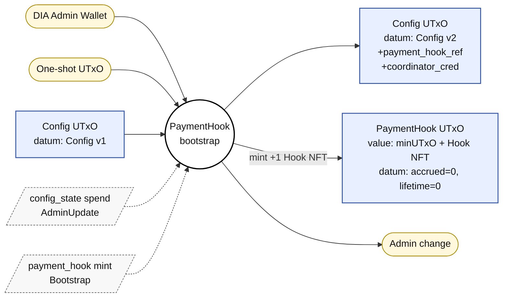

Side effect: the same tx carries a stake registration certificate for `update_coordinator`.

- **Frequency:** once per chain.
- **Inputs:**
  - DIA admin wallet.
  - The selected wallet bootstrap UTxO.
  - Config UTxO.
- **Reference inputs:** —
- **Mint:** `+1` PaymentHook NFT.
- **Outputs:**
  - Config UTxO recreated (same NFT, datum updated with `payment_hook_ref` and `coordinator_cred` if applicable).
  - PaymentHook UTxO (value = `min_utxo_lovelace` + Hook NFT, datum with `accrued_fees_lovelace = 0`).
- **Hook mint redeemer:** `Bootstrap`.
- **Config spend redeemer:** `AdminUpdate`.
- **Signers:** `config_admins`.
- **Validates:**
  - Config input NFT preserved in the output.
  - Config datum changes are limited to `payment_hook_ref` / `coordinator_cred`.
  - Hook NFT minted exactly once and placed at the new Hook UTxO.
  - Hook datum initialized: `accrued_fees = 0`, `lifetime_collected = 0`, `lifetime_withdrawn = 0`.
  - Side effect: the coordinator stake credential is registered via a registration certificate in the same tx.

### 5.3 Config update

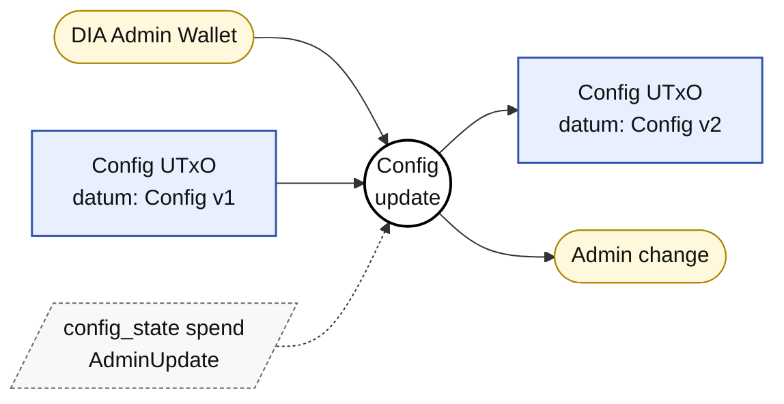

- **Frequency:** rare (rotate signers, change fee, change domain, change hook, change coordinator).
- **Inputs:** Config UTxO.
- **Reference inputs:** —
- **Mint:** —
- **Outputs:** Config UTxO recreated (same NFT, modified datum).
- **Spend redeemer:** `AdminUpdate`.
- **Signers:** `config_admins`.
- **Validates:**
  - Config NFT continuity.
  - `min_utxo_lovelace` preserved.
  - Output datum is well-formed.
  - Any datum change requires an admin signature (checked against the input datum).

### 5.4 Receiver bootstrap (per client)

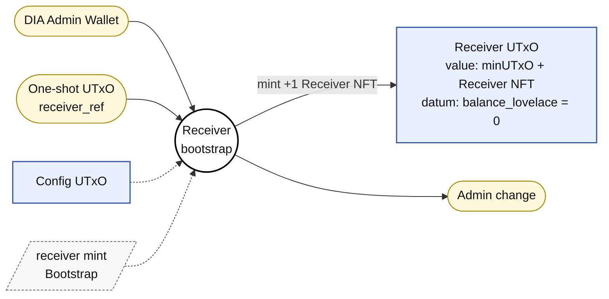

- **Frequency:** once per client.
- **Inputs:**
  - DIA admin wallet (pays network fee + min UTxO).
  - The selected wallet bootstrap UTxO for this Receiver.
- **Reference inputs:** Config UTxO (required to check the signer is in `config_admins`).
- **Mint:** `+1` Receiver NFT (policy = `receiver` parametrized for this client).
- **Outputs:** Receiver UTxO (address = `receiver<client>` spend, value = `min_utxo_lovelace` + Receiver NFT, datum = `{ balance_lovelace = 0, min_utxo_lovelace }`).
- **Mint redeemer:** `Bootstrap`.
- **Signers:** at least one `Config.config_admins` (DIA admin).
- **Validates:**
  - The parametrized output reference is consumed.
  - Exactly one Receiver NFT is minted with the expected asset name.
  - Exactly one output at the Receiver address holds the NFT.
  - Invariant `utxo.lovelace == min_utxo_lovelace + balance_lovelace`.
  - Signer is one of `config_admins` (read from the reference input).

### 5.5 Receiver top-up

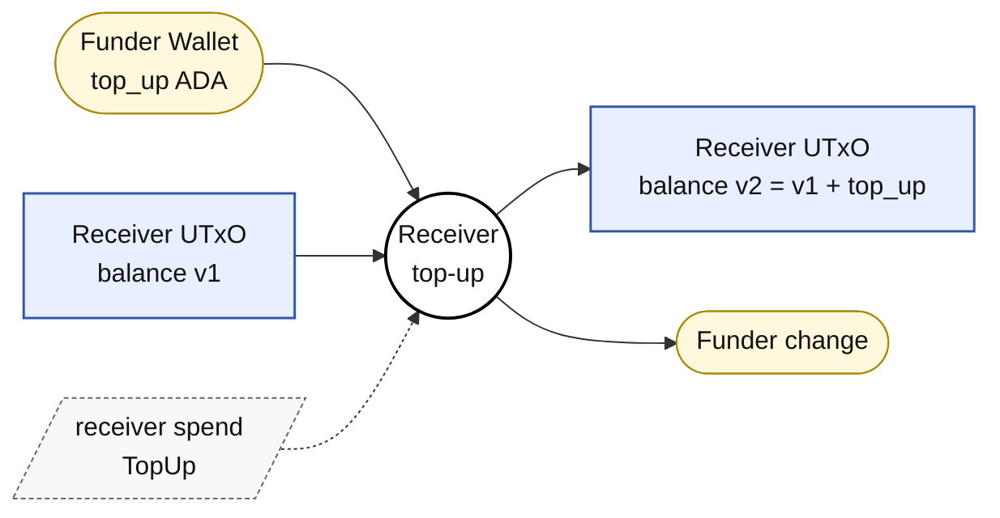

- **Frequency:** ad-hoc. Permissionless (matches EVM `receive()`).
- **Inputs:**
  - Receiver UTxO.
  - Wallet contributing the funds (the client, or anyone).
- **Reference inputs:** —
- **Mint:** —
- **Outputs:** Receiver UTxO recreated (same NFT, datum with `balance_lovelace += top_up`, `utxo.lovelace` increased by `top_up`).
- **Spend redeemer:** `TopUp`.
- **Signers:** none required by the validator (the tx is signed by whoever provides the funding input).
- **Validates:**
  - Receiver NFT continuity.
  - `min_utxo_lovelace` in the datum does not change.
  - `new.balance_lovelace == old.balance_lovelace + (new.utxo.lovelace - old.utxo.lovelace)`.
  - `new.utxo.lovelace >= old.utxo.lovelace` (cannot withdraw through this path).

### 5.6 Receiver withdraw (equivalent to EVM `retrieveLostTokens`)

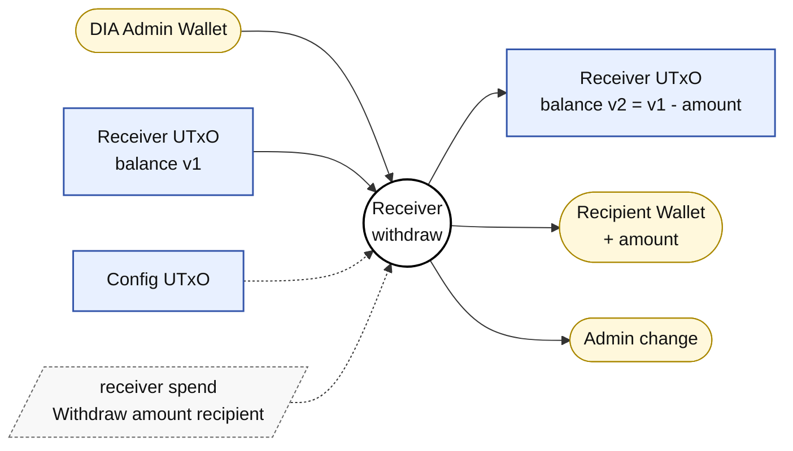

- **Frequency:** rare.
- **Inputs:** Receiver UTxO, DIA admin wallet (network fee).
- **Reference inputs:** Config UTxO.
- **Outputs:** Receiver UTxO recreated (smaller balance), payout to the address the admin specifies.
- **Spend redeemer:** `Withdraw { amount, recipient }`.
- **Signers:** at least one `Config.config_admins`.
- **Validates:**
  - Receiver NFT continuity.
  - `amount <= old.balance_lovelace`.
  - `new.balance_lovelace == old.balance_lovelace - amount`.
  - `new.utxo.lovelace == old.utxo.lovelace - amount` (exactly `amount` goes to `recipient`).
  - Signer is one of `config_admins`.

### 5.7 First pair update/create (per client × pair)

There is no separate Pair bootstrap state. The client-to-Pair binding is enforced by `pair_state` being parametrized by `receiver_hash`: client X's Pair minting policy has a different hash from client Y's. When a pair does not exist yet, the update transaction mints the Pair NFT and creates the first Pair UTxO with the signed intent's real datum.

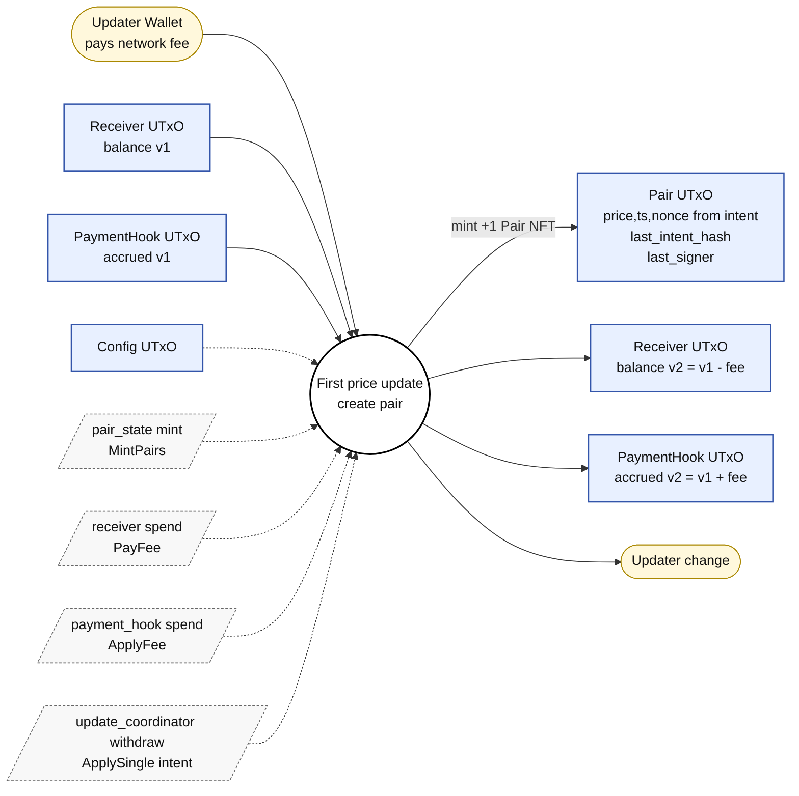

- **Frequency:** once per (client, pair).
- **Inputs:** Receiver UTxO, PaymentHook UTxO, updater wallet.
- **Reference inputs:** Config UTxO.
- **Mint:** `+1` Pair NFT (policy = `pair_state` parametrized by `receiver_hash` of this client; asset name derived from `pair_id`).
- **Withdrawals:** `update_coordinator` (withdraw 0 trigger).
- **Outputs:** Pair UTxO with `pair_id`, `price`, `timestamp`, `nonce`, `intent_hash`, and `signer` copied from the signed intent; Receiver and PaymentHook UTxOs updated for the protocol fee.
- **Mint redeemer:** `MintPairs`.
- **Coordinator withdraw redeemer:** `ApplySingle { witness }`.
- **Signers:** none required by validators; the updater only pays network fees.
- **Validates (mint policy):**
  - At least one Pair NFT is minted under this client pair policy.
  - Every minted Pair NFT has quantity `1`.
  - Every minted Pair NFT has a Pair output at the pair script address with a well-formed datum and exact min UTxO.
  - The Config reference input is valid.
  - The configured coordinator withdrawal is present.
- **Validates (coordinator):**
  - The signed intent is authorized and valid.
  - The Pair NFT asset name equals `blake2b_256(intent.symbol)`.
  - There is no existing Pair input for this token.
  - Exactly one Pair output exists for this token.
  - The output datum equals the intent's real `symbol`, `price`, `timestamp`, `nonce`, `intent_hash`, and `signer`.
  - The total minted Pair NFTs in the transaction exactly matches the create witnesses, so hidden extra pair mints are rejected.
  - Receiver and PaymentHook fee transitions are exact.

### 5.8 Price update (single) — main tx

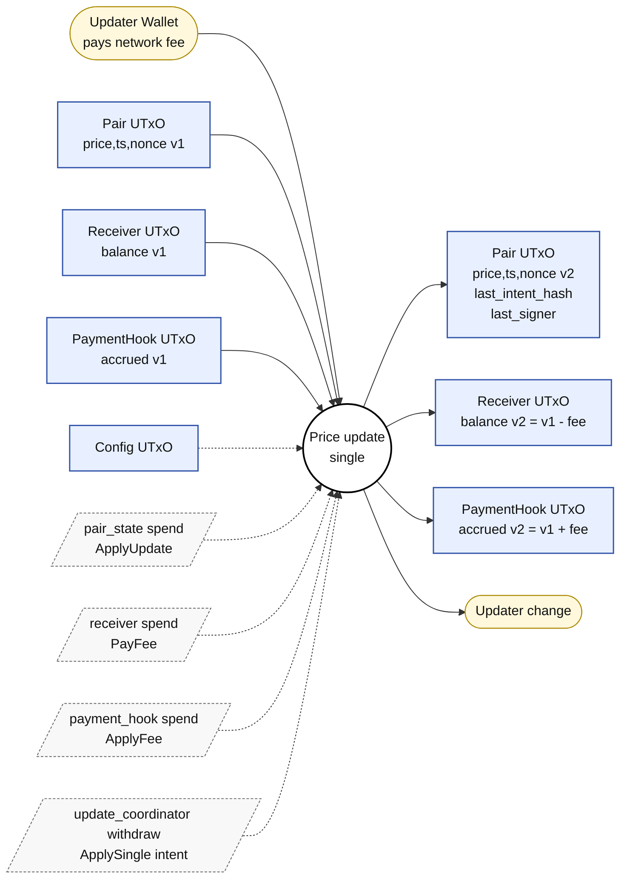

- **Frequency:** high (heartbeat / deviation).
- **Inputs:**
  - Pair UTxO being updated.
  - Receiver UTxO (client's balance).
  - PaymentHook UTxO.
  - Updater wallet (pays network fee; permissionless, does not need to be DIA).
- **Reference inputs:** Config UTxO.
- **Mint:** — if the Pair UTxO already exists. If it does not exist, this is the first pair update/create described in 5.7.
- **Withdrawals:** `update_coordinator` (withdraw 0 trigger).
- **Outputs:**
  - Pair UTxO recreated (same NFT, datum updated with new `price`, `timestamp`, `nonce`, `last_intent_hash`, `last_signer`).
  - Receiver UTxO recreated (same NFT, `balance_lovelace -= protocol_fee_lovelace`, `utxo.lovelace -= fee`).
  - PaymentHook UTxO recreated (same NFT, `accrued_fees += fee`, `lifetime_collected += fee`, `utxo.lovelace += fee`).
- **Coordinator withdraw redeemer:** `ApplySingle { witness }`, where the witness carries the Receiver NFT id, the Cardano pair policy id, the Pair NFT asset name, the DIA `OracleIntent`, and the recovered DIA signer public key.
- **Pair spend redeemer:** `ApplyUpdate`.
- **Receiver spend redeemer:** `PayFee`.
- **Hook spend redeemer:** `ApplyFee`.
- **Cardano signers:** none required by the validators (permissionless submission).
- **Validates (coordinator, once per tx):**
  - Reads Config through the reference input.
  - DIA Intent signature valid per DIA `OracleIntentUtils` (ECDSA secp256k1 over EIP-712 digest). Signer pubkey ∈ `Config.authorized_dia_public_keys`, Pair NFT asset name = `blake2b_256(intent.symbol)`, `intent.timestamp > old.timestamp`, `intent.nonce > old.nonce`.
  - `fee == Config.protocol_fee_lovelace`.
  - `new_receiver.balance == old_receiver.balance - fee`.
  - `new_hook.accrued_fees == old_hook.accrued_fees + fee`.
  - `new_hook.lifetime_collected == old_hook.lifetime_collected + fee`.
  - All NFTs remain continuous.
  - All `min_utxo_lovelace` preserved.
- **Validates (each local validator):** only that the coordinator withdrawal is present in the tx (defers to the coordinator).

### 5.9 Price update (batch)

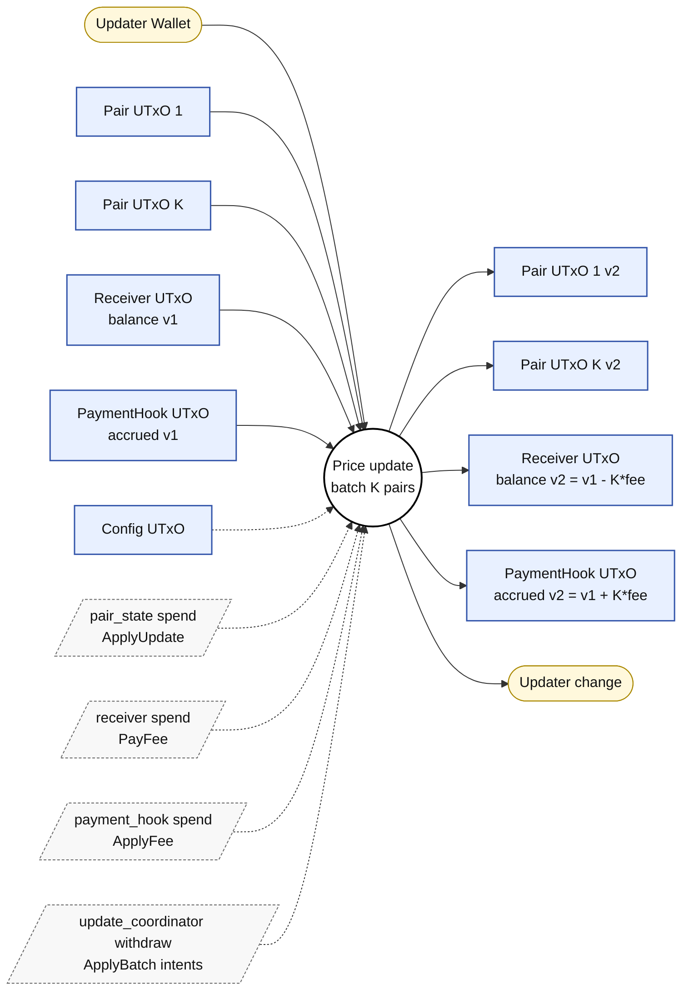

- **Frequency:** high, variant of 5.8.
- **Inputs:** existing Pair UTxOs for updates, Receiver UTxO, Hook UTxO, updater wallet.
- **Reference inputs:** Config UTxO.
- **Withdrawals:** `update_coordinator` with `ApplyBatch { [intent] }`.
- **Mint:** Pair NFTs for any batch entries whose Pair UTxO does not exist yet.
- **Outputs:** K Pair UTxOs written from K signed intents, Receiver UTxO recreated (`balance -= K * fee`), Hook UTxO (`accrued += K * fee`).
- **Validates:** same as 5.7/5.8 per intent; the coordinator iterates over the list, rejects duplicate pair units, requires a shared receiver and pair policy, and ensures the count of minted Pair NFTs equals the count of create witnesses.

### 5.10 PaymentHook withdraw

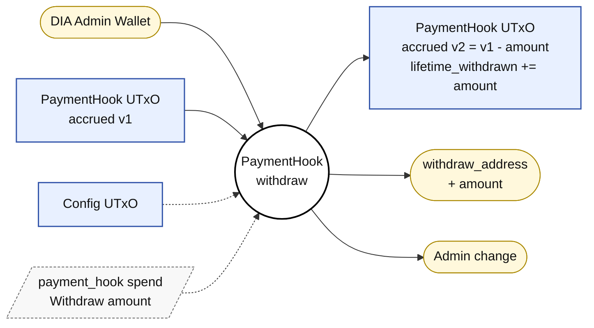

- **Frequency:** low (manual).
- **Inputs:** PaymentHook UTxO, DIA admin wallet (network fee).
- **Reference inputs:** Config UTxO.
- **Mint:** —
- **Outputs:**
  - PaymentHook UTxO recreated (same NFT, `accrued_fees_lovelace = 0`, `lifetime_withdrawn += withdrawn`, `utxo.lovelace = min_utxo_lovelace`).
  - `withdrawn` ADA paid to `Hook.withdraw_address`.
- **Spend redeemer:** `Withdraw { amount }`.
- **Signers:** `config_admins` (per the referenced Config).
- **Validates:**
  - Hook NFT continuity.
  - `amount <= old.accrued_fees_lovelace`.
  - `new.accrued_fees = old.accrued_fees - amount`.
  - `new.lifetime_withdrawn = old.lifetime_withdrawn + amount`.
  - `new.utxo.lovelace == min_utxo_lovelace + new.accrued_fees`.
  - Actual payout to `withdraw_address` of `amount`.
  - Signed by one of `config_admins`.

---

## 6. Finalized design decisions

1. **Config is shared.** One global Config UTxO is read as a reference input by Receivers, Pair states, PaymentHook, and the coordinator.
2. **Fees live in Config.** `protocol_fee_lovelace` is admin-tunable in Config and is charged per updated pair.
3. **Pair NFT asset names are hashed.** Pair asset name = `blake2b_256(pair_id)`, where `pair_id` is the UTF-8 bytes of the DIA symbol such as `USDC/USD`.
