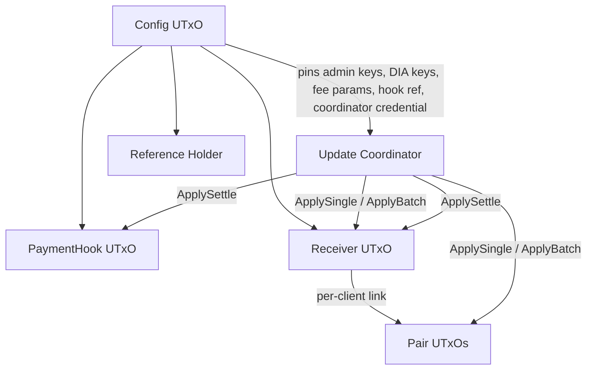
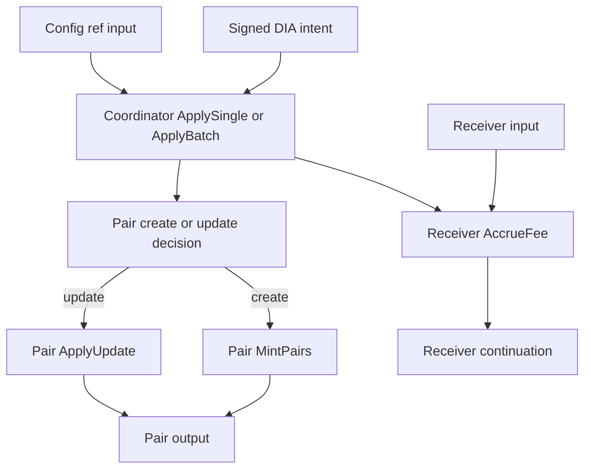

# Final Security and Coherence Audit for diadata-org/dia-cardano-oracle

## Executive summary

I reviewed the on-chain validators, the shared Aiken logic, the off-chain CLI transaction builders and preflights, the committed test suites, and the latest Milestone 1 evidence packs. The current code is materially stronger than the earlier version you described: Pair NFT creation is now admin-gated on-chain, the CLI adds the admin signer on create paths, and the Aiken suite explicitly covers missing-admin and non-admin failures for pair minting and burning. I did not find a non-admin path to mint Pair NFTs, bypass receiver fee charging, or confuse update vs. settle redeemers in the current code. fileciteturn55file0L1-L3 fileciteturn31file0L1-L3 fileciteturn29file0L1-L3 fileciteturn35file0L1-L3

The main remaining protocol-level security issue is still the same one captured in the repo’s own security notes: there is still no on-chain guarantee that only one live Pair NFT/UTxO exists for a given `(client, symbol)` at a time. The new admin-signer requirement narrows the attack surface to a config admin, but it does not provide uniqueness. A malicious or compromised admin can still create a second live pair for the same symbol by submitting another normal create transaction with `MintPairs` plus `ApplySingle` or `ApplyBatch`, omitting the existing pair input, and using a still-fresh or fresh DIA intent. That is the most important production risk still open in the design. fileciteturn38file0L1-L3 fileciteturn55file0L1-L3 fileciteturn59file0L1-L3

The batch path is coherent in its current optimized form. The code now enforces canonical witness ordering on-chain, uses positional matching for pair outputs, and avoids the old pattern of rescanning the full tx input/output lists for each witness. That is why the batch path now fits more pairs. The latest Preview evidence proves a successful **update-only** batch of 10 pairs on-chain, and the emulator benchmark shows **update-only** batches succeeding up to 12 and failing at 13. I did not find an obvious soundness hole in the optimization itself, but the coordinator has become even more load-bearing, so its length/count/order invariants must not be weakened in later refactors. fileciteturn34file0L1-L3 fileciteturn37file0L1-L3 fileciteturn59file0L1-L3 fileciteturn43file0L1-L3

The protocol fee math itself looks correct. The config in the current deployment uses `baseFeeLovelace = 600000` and `perPairFeeLovelace = 400000`. That implies 1.0 ADA per single-pair update and 4.6 ADA for a 10-pair batch. The latest evidence is consistent with that arithmetic: 11 single creates plus one 10-pair batch equals 15.6 ADA, which matches the committed receiver and payment-hook states after batch and settle. I did not find a fee calculation bug in the contracts or CLI. fileciteturn50file0L1-L3 fileciteturn31file0L1-L3 fileciteturn29file0L1-L3 fileciteturn59file0L1-L3 fileciteturn34file0L1-L3

The largest coherence problem is now documentation and evidence consistency, not core script logic. The latest README links are current, but the evidence markdown is internally inconsistent about the burned DOT/USD pair and about total ADA locked. The Aiken README also overstates what the admin-gate achieves: it prevents **unauthorized** create replays, but it does not make on-chain pair uniqueness true. The CLI README should also document more explicitly that the current `preview:settle` command supports exactly one receiver even though the on-chain settle path supports a manifest of multiple receivers. fileciteturn51file0L1-L3 fileciteturn52file0L1-L3 fileciteturn27file0L1-L3 fileciteturn44file0L1-L3 fileciteturn33file0L1-L3

## Repository map and audit scope

The repo’s load-bearing, M1-relevant surfaces are the six validator files in `contracts/aiken/validators/`, the shared Aiken logic in `contracts/aiken/lib/dia_cardano_oracle/`, the CLI transaction builders and preflights under `offchain/cli/src/`, and the evidence packs under `docs/milestones/evidence/`. The root README points to the architecture document, milestones text, latest Preview evidence pack, requirements, the Aiken README, and the CLI runbook. fileciteturn51file0L1-L3 fileciteturn52file0L1-L3

The committed test evidence is also strong. The latest `aiken check` log records 111 passing Aiken unit tests, including tests for config logic, coordinator logic, oracle logic, payment hook logic, receiver logic, and `pair_state`, and the latest `npm test` log records the off-chain test suite passing after a full emulator-driven flow. The committed `aiken build` log also shows the blueprint regenerating successfully. fileciteturn35file0L1-L3 fileciteturn42file0L1-L3 fileciteturn36file0L1-L3

The CLI exposes the repo’s operational surface: protocol init and parameterization commands, config bootstrap and reference-script publication, payment-hook bootstrap and reference-script publication, client init, receiver bootstrap, single update, batch update, settle, withdraws, min-UTxO updates, pair burn, and reference-script reclaim. That operational map matches the source files and the runbook, with one documentation caveat noted later. fileciteturn28file0L1-L3 fileciteturn27file0L1-L3 fileciteturn53file0L1-L3

A compact inventory of the validator surface is below.

| Validator file | Handlers | Main role |
| --- | --- | --- |
| `contracts/aiken/validators/config_state.ak` | `mint Bootstrap`, `spend AdminUpdate` | Global Config NFT genesis and config rotation fileciteturn57file0L1-L3 |
| `contracts/aiken/validators/payment_hook.ak` | `mint Bootstrap`, `spend ApplySettle/AdminUpdate/Withdraw` | Global fee sink, hook bootstrap, hook withdrawals, hook state admin update fileciteturn58file0L1-L3 |
| `contracts/aiken/validators/receiver.ak` | `mint Bootstrap`, `spend TopUp/AccrueFee/Settle/Withdraw/UpdateMinUtxo` | Per-client prepaid fee balance and accrued-to-hook balance fileciteturn56file0L1-L3 |
| `contracts/aiken/validators/pair_state.ak` | `mint MintPairs/BurnPairs`, `spend ApplyUpdate/UpdateMinUtxo/BurnPair` | Per-client pair NFT minting policy plus pair UTxO spend rules fileciteturn55file0L1-L3 |
| `contracts/aiken/validators/update_coordinator.ak` | `withdraw ApplySingle/ApplyBatch/ApplySettle` | Cross-script authority for updates, batches, settle arithmetic, witness validation fileciteturn59file0L1-L3 |
| `contracts/aiken/validators/reference_holder.ak` | `spend` | Admin-gated reclaim of reference-script UTxOs fileciteturn60file0L1-L3 |

## Validator and transaction validation map

The first thing to keep in mind when reading the tx maps is that Cardano validates the whole transaction as a set. The “order” below is therefore the **logical dependency order**, not a claim that script A executes before script B in a user-visible sequential sense.



This entity map is derived from the validator roles in the Aiken README and the validator implementations themselves. fileciteturn52file0L1-L3 fileciteturn55file0L1-L3 fileciteturn56file0L1-L3 fileciteturn57file0L1-L3 fileciteturn58file0L1-L3 fileciteturn59file0L1-L3 fileciteturn60file0L1-L3

### Validator-level responsibilities and redeemers

The core pattern is consistent across the protocol. `config_state`, `payment_hook`, and `receiver` each enforce strong local state transitions. `pair_state` is intentionally minimal on the hot `ApplyUpdate` path and delegates most semantic checks to `update_coordinator`. `update_coordinator` is the tx-wide source of truth for witness authenticity, update freshness, pair-output correspondence, batch ordering, create-vs-update accounting, settle arithmetic, and receiver fee charging. `reference_holder` is intentionally small and just gates reclaim behind a config signer plus a visible Config NFT input. fileciteturn55file0L1-L3 fileciteturn56file0L1-L3 fileciteturn57file0L1-L3 fileciteturn58file0L1-L3 fileciteturn59file0L1-L3 fileciteturn60file0L1-L3

A point that matters for your eye review: `PairSpendAction::ApplyUpdate` now has **no witness index** or additional fields. The off-chain tests explicitly pin that zero-field redeemer shape, and `pair_state.spend(ApplyUpdate)` only checks three things locally: Pair NFT continuity, exact lovelace continuity at the pair UTxO, and that the coordinator is running in update mode rather than settle mode. All specific witness-to-pair binding happens in `update_coordinator`. That is efficient, but it means the coordinator invariants are now absolutely load-bearing. fileciteturn43file0L1-L3 fileciteturn55file0L1-L3 fileciteturn59file0L1-L3

### Transaction family map

| Tx family | Scripts and redeemers in the same tx | What the chain enforces |
| --- | --- | --- |
| `preview:config:bootstrap` | `config_state.mint(Bootstrap)` | Consumes the configured bootstrap UTxO, mints one Config NFT with the expected asset name, and requires a valid Config output at the script with exact `min_utxo_lovelace`. fileciteturn57file0L1-L3 |
| `preview:payment-hook:bootstrap` | `config_state.spend(AdminUpdate)` + `payment_hook.mint(Bootstrap)` | Config must rotate from “no hook / no coordinator” to the exact new hook ref and coordinator credential; the tx must be signed by a config signer; a valid PaymentHook output must be created. The off-chain builder also registers the coordinator reward stake credential in this tx. fileciteturn58file0L1-L3 fileciteturn57file0L1-L3 fileciteturn70file0L1-L3 |
| `preview:receiver:bootstrap` | `receiver.mint(Bootstrap)` | Consumes the client bootstrap ref, requires a visible Config input, requires a config signer, and creates a valid Receiver output with exact lovelace. fileciteturn56file0L1-L3 |
| `preview:update` create | `update_coordinator.withdraw(ApplySingle)` + `receiver.spend(AccrueFee)` + `pair_state.mint(MintPairs)` | Coordinator validates the DIA witness, expiry, pair create path, and exact fee amount; Receiver enforces local fee movement; Pair mint requires an admin signer, a matching pair output, and a matching coordinator witness. fileciteturn59file0L1-L3 fileciteturn56file0L1-L3 fileciteturn55file0L1-L3 |
| `preview:update` existing pair | `update_coordinator.withdraw(ApplySingle)` + `receiver.spend(AccrueFee)` + `pair_state.spend(ApplyUpdate)` | Coordinator validates old-to-new pair continuity, freshness, signature recovery, expiry, and exact fee amount; Pair spend performs continuity and coordinator-mode checks; Receiver performs local fee movement. fileciteturn59file0L1-L3 fileciteturn56file0L1-L3 fileciteturn55file0L1-L3 |
| `preview:update:batch` | `update_coordinator.withdraw(ApplyBatch)` + `receiver.spend(AccrueFee)` + `N × pair_state.spend(ApplyUpdate)` + optional `pair_state.mint(MintPairs)` | Witness list must be non-empty, strict-ascending by `pair_token_name`, share the same receiver and pair policy, and line up with pair outputs in canonical order; pair-input count and mint count must match create/update accounting; the receiver fee must equal `base + N × perPair`. fileciteturn59file0L1-L3 fileciteturn29file0L1-L3 |
| `preview:settle` | `update_coordinator.withdraw(ApplySettle)` + `receiver.spend(Settle)` + `payment_hook.spend(ApplySettle)` | Coordinator requires a config signer, validates unique settle receivers and exact arithmetic from receiver drains into the single hook delta; Receiver drains accrued to zero; PaymentHook increments accrued and lifetime-collected accordingly. fileciteturn59file0L1-L3 fileciteturn56file0L1-L3 fileciteturn58file0L1-L3 |
| `preview:receiver:withdraw` | `receiver.spend(Withdraw)` | Requires a config signer; only `balance_lovelace` may decrease; the specified amount must be paid to the selected recipient; `accrued_to_hook_lovelace` cannot be drained here. fileciteturn56file0L1-L3 |
| `preview:payment-hook:withdraw` | `payment_hook.spend(Withdraw)` | Requires a config signer; only hook accrued balance may be reduced by the exact amount; payment must go to the hook’s stored withdraw address. fileciteturn58file0L1-L3 |
| `preview:config:update` | `config_state.spend(AdminUpdate)` | Requires current config signer, valid current and next config datums, NFT continuity, and exact min-ADA locking. fileciteturn57file0L1-L3 |
| `preview:payment-hook:update` | `payment_hook.spend(AdminUpdate)` | Requires config signer; may rotate withdraw address and min-UTxO but may not mutate fee counters arbitrarily. fileciteturn58file0L1-L3 fileciteturn24file0L1-L3 |
| `preview:receiver:update-min-utxo` | `receiver.spend(UpdateMinUtxo)` | Requires config signer and only permits the min-UTxO field to change. fileciteturn56file0L1-L3 |
| `preview:pair:update-min-utxo` | `pair_state.spend(UpdateMinUtxo)` | Requires config signer and only permits `min_utxo_lovelace` to change; pair identity and latest data stay frozen. fileciteturn55file0L1-L3 |
| `preview:pair:burn` | `pair_state.spend(BurnPair)` + `pair_state.mint(BurnPairs)` | Both mint side and spend side require a config signer; the exact Pair NFT in the consumed UTxO must be burned with quantity `-1` in the same tx. fileciteturn55file0L1-L3 |
| `preview:reclaim-reference-script` | `reference_holder.spend` | Requires a visible Config input and a config signer. fileciteturn60file0L1-L3 |



This update-path diagram is derived from `update_coordinator.ak`, `receiver.ak`, `pair_state.ak`, and the CLI builders for single and batch updates. fileciteturn59file0L1-L3 fileciteturn56file0L1-L3 fileciteturn55file0L1-L3 fileciteturn31file0L1-L3 fileciteturn29file0L1-L3

```mermaid
graph TD
    A[Config signer] --> B[Coordinator ApplySettle manifest]
    C[Config ref input] --> B
    D[Receiver input(s)] --> E[Receiver Settle]
    B --> E
    B --> F[PaymentHook ApplySettle]
    G[PaymentHook input] --> F
    E --> H[Receiver continuation(s)]
    F --> I[PaymentHook continuation]
```

This settle-path diagram is derived from `update_coordinator.ak`, `receiver.ak`, `payment_hook.ak`, and the current settle CLI implementation. fileciteturn59file0L1-L3 fileciteturn56file0L1-L3 fileciteturn58file0L1-L3 fileciteturn30file0L1-L3

## Security findings

### Pair creation is now correctly admin-gated on-chain

This part is fixed in the latest code. `pair_state.mint(MintPairs)` now explicitly requires `config_logic.has_config_signer(config_datum, self)`, and the same file’s regression tests cover all of the high-value edge cases: missing admin signer, wrong signer, duplicate create without admin, batch create without admin, and the fact that ordinary `ApplyUpdate` must still remain non-admin-gated. The single-update CLI adds the admin signer on create, and the batch-update CLI adds it when any create is present. fileciteturn55file0L1-L3 fileciteturn31file0L1-L3 fileciteturn29file0L1-L3 fileciteturn35file0L1-L3

That closes the earlier hole where a valid DIA intent alone could mint a new Pair NFT. It also means a manual tx without the admin key will not be able to do a create or a create-containing batch, even if it tries to bypass the CLI. fileciteturn55file0L1-L3 fileciteturn35file0L1-L3

### Duplicate live pairs are still possible for an admin

This is the main remaining protocol issue.

The current design still has no on-chain registry that says “there is already a live pair for `(receiver_hash, pair_token_name)`.” The mint path only sees the current tx. In the create branch, `update_coordinator.valid_single_update` or `valid_batch_update` decides it is a create whenever the tx does not include an existing pair input for that token name. `pair_state.mint(MintPairs)` then checks only that the tx has an admin signer, a matching pair output, and a matching witness. It does **not** prove that the chain has no other live pair UTxO with the same asset name. The repo’s security notes still document this as an open exclusion. fileciteturn59file0L1-L3 fileciteturn55file0L1-L3 fileciteturn38file0L1-L3

The exploit is plain:

1. Submit a normal create tx for a pair.
2. Wait for the receiver to roll forward.
3. Build a second **normal create tx** for the same pair token name.
4. Do **not** consume the first pair UTxO.
5. Include `MintPairs` and the normal coordinator create redeemer again, signed by an admin, using a still-fresh or fresh DIA intent.
6. The chain has no global live-pair registry to reject the second create. It succeeds and total supply for that pair token becomes 2. fileciteturn55file0L1-L3 fileciteturn59file0L1-L3

This is not a public exploit anymore. It is now an **admin-level** exploit. But it is still a real on-chain hole if your production invariant is “one live pair per client per symbol.” The honest CLI is a guardrail here, not a proof. That distinction matters, because manual txs can bypass the CLI while still satisfying the current on-chain rules. fileciteturn38file0L1-L3 fileciteturn55file0L1-L3

Severity: **Medium**.  
Exploitability: **Requires config-admin signing power and a valid DIA intent**.  
Impact: **Breaks uniqueness assumptions, can stall or confuse off-chain consumers and tooling, and can create supply > 1 for a token that most logic treats as an NFT.**

The proper fix is not another preflight. The proper fix is an **on-chain live-pair uniqueness mechanism**, for example a registry singleton per client or an index UTxO that tracks active pair token names and must be updated on pair create and burn. I would not describe the protocol as having on-chain pair uniqueness until that exists. fileciteturn38file0L1-L3

### The batch optimization is sound as written, but the coordinator is now the critical trust anchor inside update txs

The current optimization is coherent. The comments in `update_coordinator.ak` match the code: the contract now does one linear filtering pass over tx inputs and outputs to isolate pair-bearing entries, uses strict ascending witness order by `pair_token_name`, and walks the witness list positionally against filtered pair outputs. Pair inputs are still found by name inside the shorter pair-input list. The earlier expensive `N × full tx list` pattern is gone. The off-chain tests also pin the off-chain/on-chain sort equivalence and the zero-field pair update redeemer. fileciteturn59file0L1-L3 fileciteturn43file0L1-L3

The safety of this design comes from a small set of invariants that must stay intact:

- `length(pair_outputs) == length(witnesses)`
- `length(witnesses) - create_count == length(pair_inputs)`
- `minted_pair_token_count == create_count`
- strict ascending witness order by token name
- shared `(receiver_policy_id, receiver_asset_name, pair_policy_id)` across the batch
- per-witness `initial_pair_matches_witness` or `next_pair_matches_witness` checks. fileciteturn59file0L1-L3

I did not find an exploit that bypasses these in the current code. But because `pair_state.ApplyUpdate` is intentionally light, any future “small optimization” that weakens one of those coordinator invariants could create a real hole. The current performance win is acceptable; further wins should be benchmarked and reviewed against those specific invariants rather than by eyeballing total CPU or memory alone. fileciteturn55file0L1-L3 fileciteturn59file0L1-L3

Severity: **Informational, but high importance for future refactors**.  
Exploitability today: **I did not find a direct exploit in the current code**.  
Risk type: **Regression risk**.

### Permissionless relaying still means signed intents can be used to spend receiver fees

This is a design property, not a new bug. The protocol intentionally allows any wallet to pay network fees and relay a valid signed intent. Authority comes from the DIA signature, not from the updater wallet. That means if signed intents are disclosed to an unwanted relayer, that relayer can submit valid updates and cause the client’s receiver balance to be charged according to the on-chain fee formula. The relayer pays the tx fee; the client pays the protocol fee. fileciteturn38file0L1-L3 fileciteturn59file0L1-L3

This is not something to “fix” in M1 if your design goal is permissionless relaying. But it should be documented operationally, because it is a real malicious-actor scenario: a hostile relayer who gets access to fresh intents can waste a client’s prepaid receiver budget by submitting updates more aggressively than the client expected. The chain accepts those updates because they are valid. fileciteturn38file0L1-L3

Severity: **Low**.  
Exploitability: **Requires access to valid DIA intents, not private keys**.  
Impact: **Fee-budget griefing, not state corruption**.

### The settle path is safer on-chain than in the CLI, but the CLI limitation must be documented

The on-chain settle path supports a manifest of multiple receivers. `update_coordinator.valid_settle` takes a `SettleManifest`, requires uniqueness of settle receivers, and checks that the sum of receiver accrued drains exactly equals the hook delta. `payment_hook.ApplySettle` and `update_coordinator.ApplySettle` both require a config signer, which is good defense in depth. fileciteturn59file0L1-L3 fileciteturn58file0L1-L3

The CLI, however, intentionally supports only one receiver today. The current `preview:settle` implementation constructs a one-element manifest from the loaded client state, and the settle preflight explicitly rejects any manifest whose length is not exactly 1. That is not a security bug. A manual tx cannot bypass on-chain settle arithmetic by skipping the CLI. But it **is** a coherence issue: the runbook should say more clearly that multi-receiver settle is a protocol capability, while the current CLI implements only the single-client case. fileciteturn30file0L1-L3 fileciteturn44file0L1-L3

Severity: **Low**.  
Exploitability: **Not a chain exploit**.  
Impact: **Operator confusion and documentation mismatch**.

## Performance and fee analysis

### Batch capacity and canonical ordering

The latest Preview evidence proves a successful **10-pair update-only batch**. The tx log shows `fee=2.652315 ADA`, `cpu=4456501108`, and `mem=11372413` for `preview:update:batch` with 10 pairs, and the evidence markdown explicitly identifies this as step 25 in the Preview chain walk. fileciteturn34file0L1-L3 fileciteturn33file0L1-L3

The emulator benchmark is even more informative. It records update-only batches succeeding from size 1 through 12, with size 13 failing over budget. The batch resource growth is roughly linear in pair count, which is exactly what you would expect from the current filtered-list plus per-witness walk design. The benchmark also suggests that memory, not raw CPU, is the first hard ceiling at 13. fileciteturn37file0L1-L3

One important precision point for M1 presentation: the repo currently has evidence for **10-pair update-only batches**, not for **10-pair mixed create/update batches**. The Preview run creates all 11 pairs singly and only then executes a 10-pair batch update over existing pairs. The emulator benchmark follows the same logic. The code supports create-in-batch, but the committed evidence does not prove a 10-pair mixed batch budget. If you want to make a broad “10 pairs supported” claim in formal docs, I would phrase it as **“10-pair update-only batch proven on Preview”** unless you add a mixed-batch benchmark or Preview proof. fileciteturn33file0L1-L3 fileciteturn34file0L1-L3 fileciteturn37file0L1-L3

On your specific canonical-order question: yes, the current code already uses canonical order where it is safe to do so. The witness list is sorted off-chain by `pair_token_name`, the on-chain coordinator rechecks that strict ascending order, and pair outputs are matched positionally against that canonical order. The remaining input lookup by token name is still there because the contract does not assume a safe pair-token-based positional input order. So the current design is already the “best available” hybrid version of the idea you proposed. It removed the expensive full-list rescans, but it did **not** switch to full positional input matching. That is the correct choice for the assumptions encoded in the current implementation. fileciteturn29file0L1-L3 fileciteturn59file0L1-L3 fileciteturn43file0L1-L3

### Protocol fee calculation

The deployed config in the summary has `baseFeeLovelace = 600000` and `perPairFeeLovelace = 400000`. Both the single-update builder and the batch builder use exactly that formula: single update charges `base + perPair`; batch charges `base + perPair * number_of_witnesses`. The coordinator enforces the same arithmetic on-chain by calling `config_logic.calculate_protocol_fee`. fileciteturn50file0L1-L3 fileciteturn31file0L1-L3 fileciteturn29file0L1-L3 fileciteturn59file0L1-L3

The latest evidence matches the formula:

- 11 single creates × 1.0 ADA each = 11.0 ADA
- 1 batch of 10 pairs = 0.6 + 10 × 0.4 = 4.6 ADA
- total protocol fees accrued = 15.6 ADA. fileciteturn33file0L1-L3 fileciteturn34file0L1-L3 fileciteturn50file0L1-L3

That total appears consistently in the repo:

- After the 10-pair batch, the receiver state in the batch result shows `balanceLovelace = 44,400,000` and `accruedToHookLovelace = 15,600,000`. fileciteturn34file0L1-L3
- The final hook state shows `lifetimeCollectedLovelace = 15,600,000`, `lifetimeWithdrawnLovelace = 10,000,000`, and `accruedFeesLovelace = 5,600,000`. fileciteturn50file0L1-L3
- The final receiver state shows `accruedToHookLovelace = 0` after settle, which is exactly what the scripts enforce. fileciteturn50file0L1-L3

So the protocol fee logic is coherent. I do **not** see a bug in the fee formula.

### Where the evidence markdown is still wrong

The problem is not the fee formula. The problem is the evidence write-up.

The latest evidence markdown reports `Net ADA locked in protocol = 246.243570 ADA`, but its own UTxO breakdown table sums to `244.243570 ADA`. The repo’s payment-hook bootstrap code also registers the coordinator reward stake credential in that tx, which strongly suggests the unexplained 2 ADA gap is the coordinator stake registration deposit that the markdown forgot to account for explicitly. In other words: the arithmetic can be reconciled, but the evidence file needs to say so. fileciteturn33file0L1-L3 fileciteturn70file0L1-L3

## Documentation and coherence updates required before final M1 submission

The formal docs are mostly aligned now, but they are not fully clean. The exact updates I would make are these.

### Update the latest Preview evidence markdown

File: `docs/milestones/evidence/m1-preview-20260515-130925/milestone-1-preview-evidence.md` fileciteturn33file0L1-L3

This is the largest actionable documentation item.

What to fix:

| Issue | Current state | Required change |
| --- | --- | --- |
| Burn step omitted from the main Preview step list | The main tx table stops at step 30, but the on-chain fee audit includes a pair burn tx, and `SUMMARY.json` records `burnPairSlug = dot-usd` and `burnedPairCount = 1`. fileciteturn33file0L1-L3 fileciteturn50file0L1-L3 | Add the pair-burn step to the main tx table and to the explorer-links section, or remove it from the fee audit if it is intentionally out of scope for that final snapshot. |
| Final live-pair accounting inconsistent | The markdown says “Pair UTxOs × 10 (1 burned excluded),” but the final price table still lists DOT/USD as if it remained live. `SUMMARY.json` also shows burn metadata. fileciteturn33file0L1-L3 fileciteturn50file0L1-L3 | If the snapshot is post-burn, remove DOT/USD from the live final-price table or mark it separately as burned. If the snapshot is pre-burn, then the locked-breakdown and total-fee sections need to be adjusted instead. |
| 2 ADA locked-value gap | Net locked says `246.243570`, but the UTxO breakdown totals `244.243570`. PaymentHook bootstrap registers the coordinator stake credential. fileciteturn33file0L1-L3 fileciteturn70file0L1-L3 | Add a line for the coordinator stake registration deposit, or explicitly explain the difference between UTxO-locked ADA and total protocol-locked ADA. |
| Scope of batch-capacity proof overbroad if read loosely | The prose can be misread as “the protocol supports 10 pairs in general,” while the evidence actually proves a 10-pair update-only batch. fileciteturn33file0L1-L3 fileciteturn34file0L1-L3 | Phrase the claim as “10-pair update-only batch proven on Preview.” |

### Correct the Aiken README wording about duplicate-pair prevention

File: `contracts/aiken/README.md` fileciteturn52file0L1-L3

The current wording says that pair create is admin-gated “so an intent cannot be replayed across two transactions to mint duplicate pairs.” That is too strong. The security-notes document in the same repo still says admins can create duplicate pairs because there is no on-chain live-pair registry. Those two docs are not fully coherent. fileciteturn52file0L1-L3 fileciteturn38file0L1-L3

Suggested replacement text:

“Pair create + burn are admin-gated. A signed DIA intent alone is not enough to mint or burn a Pair NFT. This prevents **unauthorized** creation or burn by a relayer. It does **not** by itself provide on-chain live-pair uniqueness; a config admin can still create duplicates unless a live-pair registry is added.”

### Update the CLI README source-file list and settle limitation

File: `offchain/cli/README.md` fileciteturn27file0L1-L3

The command list is current, but the “Source Files” section is incomplete compared with the actual transaction modules present in the repo. The search results show additional transaction files that should be listed in that section: `payment-hook-update.ts`, `receiver-update-min-utxo.ts`, `pair-update-min-utxo.ts`, and `pair-burn.ts`. fileciteturn27file0L1-L3 fileciteturn53file4L1-L3 fileciteturn53file5L1-L3 fileciteturn53file9L1-L3 fileciteturn53file12L1-L3

The settle section should also explicitly say that:

- the **on-chain** protocol supports a settle manifest of multiple receivers, but
- the **current CLI** supports exactly one receiver in `preview:settle`. fileciteturn44file0L1-L3 fileciteturn30file0L1-L3

### Keep the root README as-is

File: `README.md` fileciteturn51file0L1-L3

I did not identify a mandatory root-README change. Its link to the newest evidence pack is current, and its high-level workflow is consistent with the repo layout and current CLI surface. The cleanup burden is lower-level: evidence markdown, Aiken README wording, and CLI README details. fileciteturn51file0L1-L3

## Remediation and test plan

### Priority actions before final M1 presentation

The shortest honest, production-oriented checklist is this:

| Priority | Action | Why |
| --- | --- | --- |
| Highest | Decide whether admin-level duplicate live pairs are acceptable for M1 | This is the only remaining material on-chain design hole I found. If you are not fixing it now, disclose it clearly as a known limitation. fileciteturn38file0L1-L3 |
| Highest | Fix `milestone-1-preview-evidence.md` | It currently contradicts itself about live pair count, pair burn, and locked ADA. fileciteturn33file0L1-L3 fileciteturn50file0L1-L3 |
| High | Correct the overstatement in `contracts/aiken/README.md` | The doc currently implies admin-gating solved duplicate-pair replays completely. It did not. fileciteturn52file0L1-L3 fileciteturn38file0L1-L3 |
| High | Update `offchain/cli/README.md` | Add the missing transaction modules and the explicit single-receiver settle note. fileciteturn27file0L1-L3 fileciteturn44file0L1-L3 |
| Medium | Phrase batch capacity precisely | Say “10-pair update-only batch proven on Preview.” Do not overclaim mixed-batch capacity without extra evidence. fileciteturn33file0L1-L3 fileciteturn37file0L1-L3 |

### Priority actions before mainnet production

If you want stronger production-grade guarantees, these are the next steps.

The first is the uniqueness fix. If “one live pair per symbol per client” is a production invariant, put it on-chain. A registry design is the clean fix. Without that, you are relying on admin behavior and CLI discipline. That may be acceptable as a trusted-admin operational model, but it should be an explicit decision, not an accidental assumption. fileciteturn38file0L1-L3

The second is to add one more benchmark scenario: a **mixed create/update batch** at size 10. The current code supports it, but your current evidence does not prove its budget. If you never plan to use create-in-batch operationally, that is fine. If you do plan to use it, benchmark it and document it separately. fileciteturn29file0L1-L3 fileciteturn37file0L1-L3

The third is to preserve the current coordinator invariants if you continue optimizing. The current version is efficient enough for 10 update-only pairs on Preview and 12 in emulator, so I would not trade away semantic redundancy lightly. The remaining room is real, but it is not “free.” fileciteturn34file0L1-L3 fileciteturn37file0L1-L3 fileciteturn59file0L1-L3

### Suggested additional tests

The committed tests are already strong, but I would still add three targeted regressions.

The first missing regression is a **batch output-order mismatch** test in the coordinator. That is the exact place where the new positional-output optimization could regress if someone later refactors the builder or the walk logic. The second is a **mixed create/update batch benchmark or emulator test** at size 10. The third is a **documentation-backed operational test** that compares live-pair count in the final summary against the evidence markdown’s final-price table so the burn inconsistency cannot recur in future evidence packs. fileciteturn43file0L1-L3 fileciteturn37file0L1-L3

Example Aiken test skeleton for output-order mismatch in `contracts/aiken/validators/update_coordinator.ak`:

```aiken
test valid_batch_update_rejects_output_order_mismatch() {
  // Build two sorted witnesses: token_a < token_b
  let witnesses = [witness_a, witness_b]

  // Build pair outputs in the WRONG order: token_b, token_a
  let pair_outputs = [
    (witness_b.pair_token_name, output_b),
    (witness_a.pair_token_name, output_a),
  ]

  let (ok, _) =
    walk_batch_witnesses(
      self,
      config_datum,
      domain_sep,
      witness_a.pair_policy_id,
      witness_a.receiver_policy_id,
      witness_a.receiver_asset_name,
      witnesses,
      pair_outputs,
      pair_inputs,
      None,
      True,
      0,
    )

  !ok
}
```

This test should live next to the existing batch-order tests in `update_coordinator.ak`, because that file already contains the canonical-order logic and its current regression net. fileciteturn59file0L1-L3

Example Aiken test skeleton for duplicate settle receivers in `contracts/aiken/validators/update_coordinator.ak`:

```aiken
test unique_settle_receivers_rejects_duplicate_receiver() {
  let r =
    SettleReceiver {
      receiver_policy_id: #"...",
      receiver_asset_name: #"...",
    }

  !unique_settle_receivers([r, r])
}
```

That function already exists on-chain. The test is cheap and guards a future CLI expansion to multi-receiver settle. fileciteturn59file0L1-L3

For the mixed batch capacity proof, I would use the existing emulator benchmark path rather than Aiken unit tests. The repo already has the benchmark script and benchmark evidence format, so the cleanest extension is another benchmark scenario rather than forcing a huge Aiken unit fixture. fileciteturn41file0L1-L3 fileciteturn37file0L1-L3

## Open questions and limitations

I did not independently re-run `aiken check`, `aiken build`, or the CLI flow in an execution sandbox; the strongest execution evidence I could rely on here is the repo’s committed `aiken check`, `aiken build`, `npm test`, Preview chain-walk logs, and emulator benchmark logs. Those are substantial, but they are still committed evidence rather than a fresh run during this review. fileciteturn35file0L1-L3 fileciteturn36file0L1-L3 fileciteturn42file0L1-L3 fileciteturn33file0L1-L3 fileciteturn37file0L1-L3

I also did not re-audit admin key custody or DIA signer key custody, per your requested scope, and I did not audit the correctness of the price source itself. The conclusions above are about contract and CLI safety, tx-shape coherence, fee accounting, batch capacity, and documentation integrity within that scope. fileciteturn38file0L1-L3